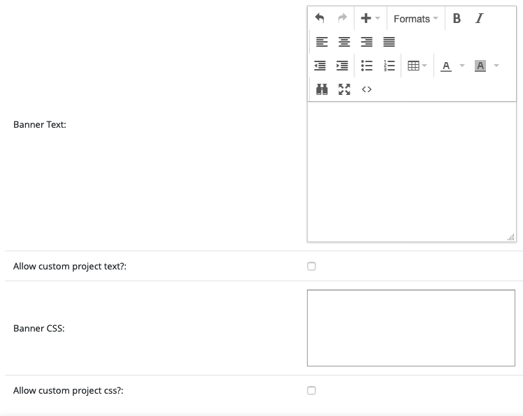
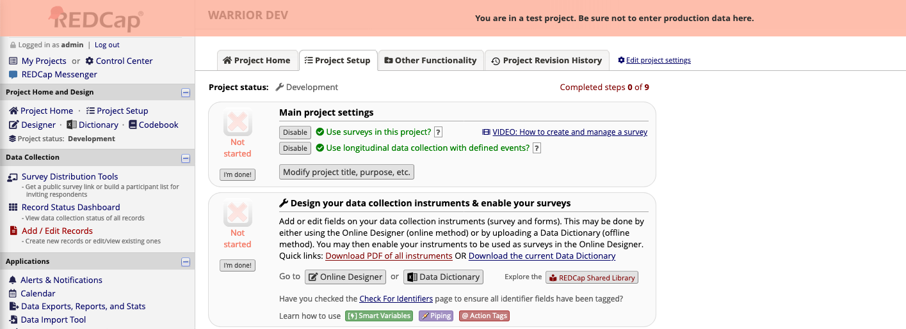

# Project Overlay Banner

A REDCap module to display a temporary overlay banner on a project to alert users that it is a training or other non-production project. This module is designed to be enabled and configured at the project-level where it is needed. It was created to reduce the risk of data entry in training projects that look and behave like the production project.

## Prerequisites
- REDCap >= 9.3.0
- REDCap Module Framework version 3

## Easy installation
- Install the Project Overlay Banner module from the Consortium [REDCap Repo](https://redcap.vanderbilt.edu/consortium/modules/index.php) from the control center.
- Go to **Control Center > External Modules**, enable Project Overlay Banner.

## Manual Installation
- Clone this repo into to `<redcap-root>/modules/project_overlay_banner_v0.0.0`.
- Go to **Control Center > External Modules**, enable Project Overlay Banner.

## Configuration

This module can be configured at the global level and/or at the project level. Left unconfigured, it will display the default styling and text for the banner. If configured at the system level, that configuration will override the built-in default. Similarly, it can be configured at the project level to override any built-in or system configuration. REDCap admins can enforce the system configuration if needed.

These options are available:

- **Banner Text**: The text that will appear in the banner.
- **Allow custom project text**: A toggle that controls whether or not the **Banner Text** set at the project level will override the system level **Banner Text**.
  - Only available in the Control Center configuration.
- **Banner CSS**: Custom CSS applied to the banner, loaded _in addition_ to the [default CSS](css/banner.css). Custom set properties will override those properties in the default CSS.
- **Allow custom project css**: A toggle that controls whether or not the **Banner CSS** set at the project level will override the system level **Banner CSS**.
  - Only available in the Control Center configuration.

## Example

In its default configuration, the temporary banner looks like this:

Upon clicking the banner, it will disappear and the page will function normally. At the next page load and at _every_ page load for a configured project, the banner will reappear.
